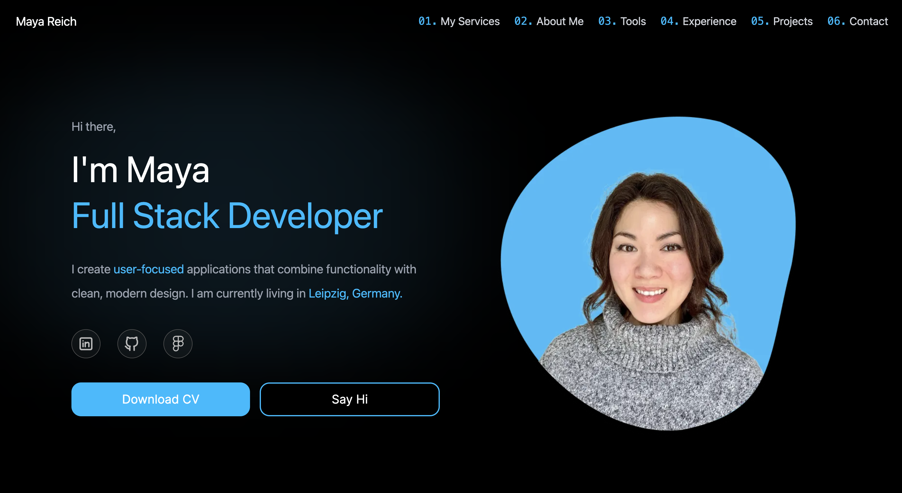

<div align="center">
  
</div>

<h1 align="center">
  mayareich.dev - Portfolio Website
</h1>

<p align="center">
  The personal portfolio website of <a href="https://mayareich.dev" target="_blank">Maya Reich</a>, 
  built with <a href="https://vitejs.dev/" target="_blank">Vite + React</a>, 
  styled with <a href="https://tailwindcss.com/" target="_blank">Tailwind CSS</a>, 
  and hosted with <a href="https://vercel.com/" target="_blank">Vercel</a>.
  Showcases my skills and projects as a Full Stack Web Developer and designed to be fully responsive on all devices.
</p>

<p align="center">
  
</p>

## Features
- **Responsive Design** – optimized for desktop and mobile
- **Project Showcase** – live demos and GitHub links for all featured projects
- **Dynamic Contact Form** – integrated with backend for email handling
- **Smooth Animations** – modern, clean UI with interactive transitions
- **Optimized Initial Load** – performance improvements for faster first paint

## Tech Stack
- **Frontend:** React, TypeScript, Tailwind CSS
- **Animations:** Framer Motion
- **Deployment:** Vercel, Render
- **Backend:** Node.js, Express, Nodemailer

## Live Demo
- 🌍 [Portfolio Website](https://mayareich.dev)  
- 🚀 Deployed with [Vercel](https://vercel.com)

## Installation & Setup

1. Clone the repository:
   
   ```bash
   git clone https://github.com/mreich06/portfolio.git
   
   cd portfolio/client
   ```
   
2. Install dependencies for both client and server:
   
   ```bash
   cd client
   
   npm install
   
   cd ../server
   
   npm install
   ```

3. Start the development servers:

   **Frontend (Vite + React):**
   ```bash
   cd client

   npm run dev
   ```
   Open your browser at:
   ```arduino
   http://localhost:5173
   ```

   **Backend (Node/Express):**
   ```bash
   cd server

   npm run dev
   ```
   By default runs on:
   ```arduino
   http://localhost:5000
   ```    

## Environment Variables
   In the server/.env file, add:
   
   ```bash
   RESEND_API_KEY=your-resend-api-key
   EMAIL_TO=your-email@example.com
   PORT=3000
   CLIENT_ORIGIN=http://localhost:5173
   ```

## Future Improvements
- Expand project details
- More animations and interactive elements

## Contributing
- You are welcome to fork this repository for reference or inspiration.

## License
- This project is licensed under the MIT License.
- You are free to use and adapt the code with proper attribution.
